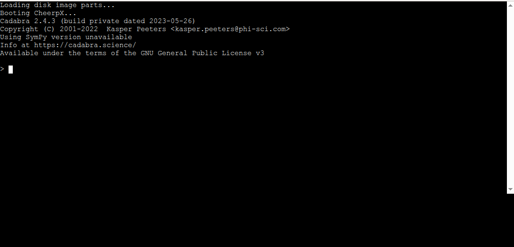

Cadabra in Browser

Try it here: https://wangyenshu.github.io/Cadabra-in-Browser/

Screenshot on chrome:

How to build:

- clone this project
- remove previous ext2.part* files
- run bash.sh

Credit:
- Cadabra: https://cadabra.science/
- Cheerpx: https://cheerpx.io/docs/getting-started
- Cheerpx License: https://cheerpx.io/licensing
- https://github.com/gzuidhof/coi-serviceworker
